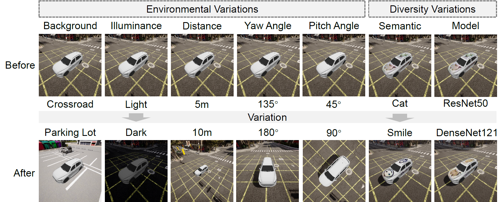
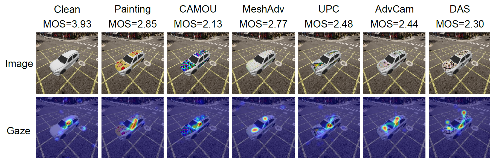
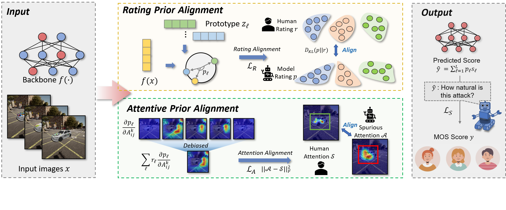

# Towards Benchmarking and Assessing Visual Naturalness of Physical World Adversarial Attacks

In this paper, we contribute the first *Physical Attack Naturalness (PAN) dataset* with human rating and gaze to benchmark attack naturalness.

We also introduce Dual Prior Alignment (DPA) network, which aims to embed human knowledge into model reasoning process. Specifically, DPA imitates human reasoning in naturalness assessment by rating prior alignment and mimics human gaze behavior by attentive prior alignment.

## Physical Attack Naturalness (PAN) dataset

*Physical attack naturalness (PAN) dataset* is the first dataset to understand naturalness of physical world attacks in autonomous driving. In PAN dataset, we consider 7 baselines, 2 backgrounds, 2 illuminance, 8 pitch angles, 4 yaw angles and 3 distances, resulting in 7×2×2×8×4×3 = 2688 images. For each image, we also release its gaze saliency map, subjective naturalness ratings evaluated by MOS (Mean Opinion Score) and rating distribution.

We also collected 504 real world adversarial images, called *PAN-phys* with 8 pitch angles, 3 yaw angles and 3 backgrounds, resulting in 7×8×3×3 = 504 images with their gaze saliency maps, subjective naturalness ratings and rating distributions.

The dataset can be found in https://drive.google.com/drive/folders/1nGiU8cO5d3BGKxFP4Y1MlWot8UqvehwZ?usp=share_link

### Example images

#### PAN





#### PAN-phys


### File structure

* `PAN`
  * `image`: all the adversarial images with a resolution of 2048×2048, divided by different baselines and backgrounds
  * `gaze`: pre-processed gaze saliency map with shape (224, 224)
  * `score`: subjective naturalness ratings, including MOS and rating distribution
* `PAN-phys`
  * `image`: all the real world adversarial images with a resolution of 224×224, divided by different baselines
  * `gaze`: pre-processed gaze saliency map with shape (224, 224)
  * `score`: subjective naturalness ratings, including MOS and rating distribution

## DPA framework



## Dependencies

* You need to download our *Physical Attack Naturalness (PAN) dataset* from the above link and unzip it into `data` folder.
* Requirements: 
  * pytorch >= 1.11.0
  * scipy >= 1.8.1
  * numpy >= 1.22.4

* (Optional) You can also download our pretrained model and *PAN-phys dataset* from the above link.

## Running

```
python train.py --train --eval --test 
```

Results will be saved in `src/logs/`, including:

* checkpoint
* validation / test score data
* `result.txt`, containing validation / test results
